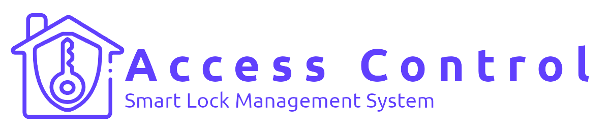

# 🔐 AccessControl 3.0

AccessControl is a modern **Smart Lock Management System** designed for secure, efficient, and real-time management of access across your facilities.  
It combines a robust backend built on **.NET 8** with a rich **Angular + PrimeNG** frontend to deliver a clean, intuitive experience for administrators and operators.

> **Current version:** `3.0.0`

---

## ✨ Highlights (v3.0)

AccessControl 3.0 introduces several core improvements and new capabilities:

- ✅ **Real-time updates with SignalR**
  - Live events feed and lock status updates pushed instantly to the UI
  - SignalR Hub on the **Live Event** page for updating the events/locks table in real time

- 🔄 **Event-driven backend with MassTransit & RabbitMQ**
  - Lock/unlock commands and other domain events are handled asynchronously
  - Improved reliability and scalability for high-volume environments

- 🧠 **Clean architecture with CQRS & MediatR**
  - Commands/queries are clearly separated
  - Better maintainability, testability, and extensibility

- 🧱 **Centralized `SaveChangesAsync` in the backend**
  - Single, consistent place for transaction handling and cross-cutting concerns
  - Easier to enforce logging, auditing, and domain events dispatching

- 📊 **Revamped dashboard**
  - Lock/Unlock overview with lock status statistics
  - Cards and charts tailored for access control monitoring
  - Space for listing all locks with their current status (wired to backend API)

- 🔐 **Improved security**
  - JWT-based authentication and authorization
  - Clear separation of roles and permissions (e.g., admins vs operators)

---

## 🚀 Overview

AccessControl helps you:

- Manage **sites**, **locks**, **cardholders**, and **schedules** from a single, unified interface  
- Grant or revoke access instantly across your organization  
- Monitor **who accessed what and when** using live events and history views  
- Gain visibility through dashboards, statistics, and status views

It’s designed to be **enterprise-ready** yet approachable for teams that just want to manage smart locks without friction.

---

## 🧩 Core Concepts

AccessControl works with a few key domain entities:

- **Site**  
  Represents a physical location or facility (e.g., HQ building, warehouse, branch office).

- **Lock**  
  An entry point within a site (e.g., main door, server room, warehouse gate).

- **Cardholder**  
  A person who can be granted access permissions (employees, contractors, guests).

- **Schedule**  
  Defines **when** a cardholder can access certain locks (dates, days, time ranges).

- **Live Event**  
  Real-time events representing lock operations and activities  
  (e.g., access granted/denied, lock/unlock commands, system notifications).

---

## 🧱 Architecture & Tech Stack

**Backend**

- [.NET 8](https://dotnet.microsoft.com/) (Web API)
- **MediatR** for CQRS (Commands & Queries)
- **MassTransit** with **RabbitMQ** for event-driven communication
- Centralized `SaveChangesAsync` in the data layer for:
  - Transaction management  
  - Auditing / logging hooks  
  - Domain events dispatch
- **JWT** for authentication & authorization
- Relational database (e.g. SQL Server / PostgreSQL)

**Frontend**

- **Angular** (latest stable used in this project)
- **PrimeNG** UI component library
- **SignalR** client for live updates (Live Event page, dashboard widgets)
- Responsive dashboard with:
  - Lock/Unlock statistics  
  - Lock list with current status  
  - Live events and filters (e.g., by entity type: Site, Lock, Cardholder, Schedule)

---

## 🌐 Real-Time & Messaging

### SignalR (Real-time updates)

- SignalR hub exposed from the backend for:
  - Live event streaming
  - Lock status changes
- Angular client:
  - Connects to hub on the **Live Event** page
  - Updates the events table and lock status indicators in real time
  - Ensures operators see the latest access activity without manual refresh

### RabbitMQ + MassTransit (Event-driven backbone)

- Backend publishes and consumes messages via **RabbitMQ** using **MassTransit**
- Common use cases:
  - Lock/unlock commands
  - Synchronization with external devices/systems
  - Background processing of access events

This combination enables a robust, decoupled system that remains responsive even under load.

---

## 📊 Dashboard

The AccessControl dashboard is focused on **operational visibility**:

- **Lock & Unlock overview**
  - High-level stats of how many locks are currently *Locked* vs *Unlocked*
  - Additional chart(s) visualizing lock statuses and event activity

- **Lock status list**
  - List of all locks with their current status (Locked / Unlocked)
  - Space to plug in APIs for:
    - Triggering Lock/Unlock actions
    - Navigating to details for a given lock or site

- **Live events**
  - Integration with the SignalR live events stream
  - Filters by entity type (Site, Lock, Cardholder, Schedule), event type, etc.

---
# 🧑‍💻 AccessControl – Setup & Installation Guide

This README explains **everything required to set up and run AccessControl** locally for development and testing.  
It covers backend, frontend, RabbitMQ, database setup, configuration, and troubleshooting.

---

## ✅ 1. System Requirements

Make sure your machine has the following installed:

- **.NET 8 SDK**
- **Node.js (LTS) + npm**
- **Angular CLI**
- **Database server** (SQL Server / PostgreSQL)
- **RabbitMQ**
- **Git**

---

## 📥 2. Clone the Repository

```bash
git clone https://github.com/Kjamil44/AccessControl.git
cd AccessControl
```

---

## 🐇 3. Start RabbitMQ

### Option A: Docker

Create or update `docker-compose.yml`:

```yaml
version: "3.8"
services:
  rabbitmq:
    image: rabbitmq:3-management
    container_name: accesscontrol-rabbitmq
    ports:
      - "5672:5672"
      - "15672:15672"
    environment:
      RABBITMQ_DEFAULT_USER: guest
      RABBITMQ_DEFAULT_PASS: guest
```

Start it:

```bash
docker compose up -d
```

RabbitMQ UI: **http://localhost:15672**  
User/password: `guest` / `guest`

> After setup, there should be two queues on the RabbitMQ Management board: `trigger-lock` and `trigger-unlock`
---

## 🗄 4. Database Setup

Create an empty database named for example:

`AccessControlDb`

### Example connection strings

#### SQL Server
```
Server=localhost;Database=AccessControlDb;User Id=sa;Password=YourStrong!Passw0rd;TrustServerCertificate=True;
```

#### PostgreSQL
```
Host=localhost;Port=5432;Database=AccessControlDb;Username=postgres;Password=yourpassword;
```

---

## 🔧 5. Backend Setup (.NET 8)

```bash
cd backend
dotnet restore
```

### 5.1 Configure `appsettings.Development.json`

#### ConnectionStrings
```json
"ConnectionStrings": {
  "DefaultConnection": "Server=localhost;Database=AccessControlDb;User Id=...;Password=...;"
}
```

#### RabbitMQ
```json
"RabbitMq": {
  "Host": "localhost",
  "Username": "guest",
  "Password": "guest"
}
```

#### JWT
```json
"Jwt": {
  "Issuer": "your-issuer",
  "Audience": "your-audience",
  "SigningKey": "a-very-long-secret-key"
}
```

#### CORS
```json
"Cors": {
  "AllowedOrigins": [
    "http://localhost:4200"
  ]
}
```

---

### 5.2 Create new build profile, while running the API, Messaging and Contracts projects 

```bash
dotnet run
```

API will start (example):  
`https://localhost:7200`

---

## 🌐 6. Frontend Setup (Angular)

```bash
cd ../AccessControl.UI
npm install
```

### 6.1 Configure `environment.ts`

```ts
export const environment = {
  production: false,
  baseApiUrl: 'https://localhost:7200',
  signalRHubUrl: 'https://localhost:5001/hubs/live-events'
};
```

### 6.2 Run Angular

```bash
ng serve
```

App runs at: **http://localhost:4200**

---

## 🔐 7. Authentication / Admin User

- After the first API run, an empty `mt_doc_user` table will be created.
- New user can perform a registration on Angular site (AcessControl.UI)

---

## 🧪 8. Verify Setup

- Login works  
- Dashboard loads  
- Locks, Sites, Cardholders pages load  
- Live Events update in real-time  
- RabbitMQ queues active (check via rabbitmq-management or via AccessControl.Contracts Command Line)

---

## 🧩 9. Development Workflow

- Use **CQRS + MediatR** for backend features  
- Use unified **SaveChangesAsync** in persistence  
- Use **SignalR** for real-time communication  
- Use **MassTransit** for async messaging  

---

## 🛠 10. Troubleshooting

### ❌ Frontend can't reach backend
- Check `baseApiUrl`
- Check CORS

### ❌ SignalR error
- Check hub URL
- Check HTTPS vs HTTP mismatch

### ❌ RabbitMQ connection error
- Confirm container is running  
- Check host + credentials

---

## ✅ 11. Quick Setup Summary

```bash
# Backend
cd backend
dotnet restore
dotnet run AccessControl.API, AccessControl.Messaging, AccessControl.Contracts

# Frontend
cd ../AccessControl.UI
npm install
ng serve
```

Then open **http://localhost:4200**.

---

🎉 You are now ready to work with **AccessControl 3.0**!
